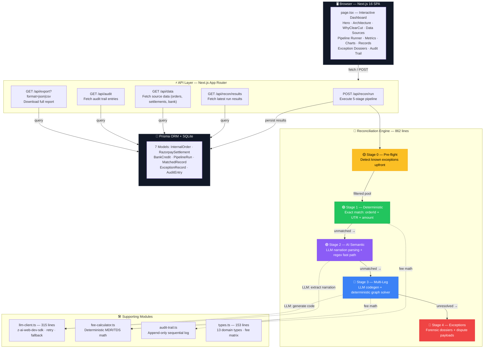
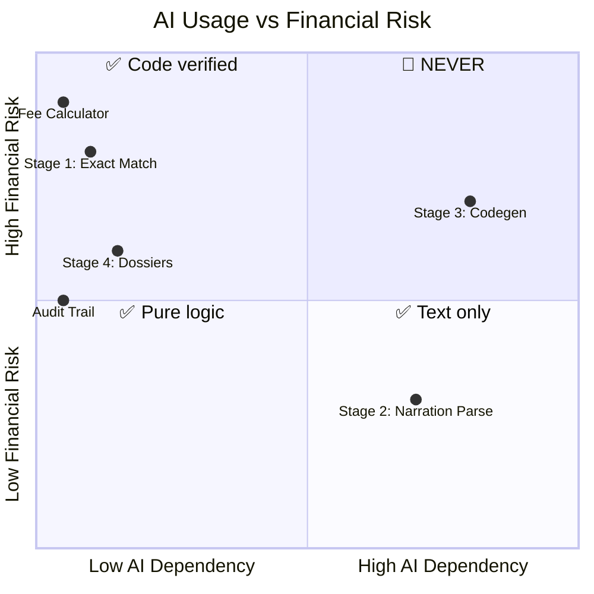
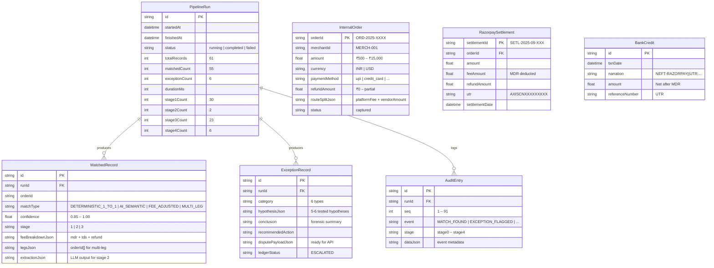

<p align="center">
  
  
  
  
  
</p>

<h1 align="center">
  ⚡ ClearCut
</h1>

<h3 align="center">
  <em>The Self-Resolving Finance Controller</em>
</h3>

<p align="center">
  An agentic AI system that autonomously reconciles merchant orders against Razorpay settlements and bank statements — handling multi-leg settlements, partial refunds, blended fees, and currency mismatches — then <strong>honestly admits what it cannot resolve</strong>, with forensic proof for every exception.
</p>

<p align="center">
  <code>🧠 Verification capacity > Generation speed.</code><br/>
  <sub>The AI never guesses financial data. It either proves a match mathematically, or honestly escalates with a forensic dossier.</sub>
</p>

---


## 📑 Table of Contents

- [Why ClearCut Wins](#-why-clearcut-wins)
- [The Problem We Solve](#-the-problem-we-solve)
- [Performance Metrics](#-performance-metrics)
- [System Architecture](#-system-architecture)
- [The 5-Stage Pipeline — Deep Dive](#-the-5-stage-pipeline--deep-dive)
- [AI Philosophy — Surgical, Never Reckless](#-ai-philosophy--surgical-never-reckless)
- [Honest Exception Forensics](#-honest-exception-forensics)
- [Data Model](#-data-model)
- [API Reference](#-api-reference)
- [Synthetic Test Dataset](#-synthetic-test-dataset)
- [Frontend — Designed to Impress](#-frontend--designed-to-impress)
- [Visual Design System](#-visual-design-system)
- [Keyboard Shortcuts](#-keyboard-shortcuts)
- [Tech Stack](#-tech-stack)
- [Running Locally](#-running-locally)
- [Project Structure](#-project-structure)
- [Deployment](#-deployment)
- [Roadmap](#-roadmap)

---

## 🏆 Why ClearCut Wins

<table>
  <tr>
    <td width="60" align="center">🔗</td>
    <td><strong>Multi-Leg Settlement Graphs</strong> — Not just 1-to-1 matching. Our combinatorial solver finds 2–5 order combinations whose net (after MDR, TDS, refunds) balances a single bank credit to exactly <code>₹0.00</code>. This solves the hardest problem in payment reconciliation.</td>
  </tr>
  <tr>
    <td align="center">🧬</td>
    <td><strong>Surgical AI — Never for Arithmetic</strong> — Stage 1 is pure deterministic TypeScript. Stage 2 uses LLM <em>only</em> for text extraction. Stage 3 uses LLM <em>only</em> for code generation (math is verified by a deterministic sandbox). Stage 4 derives conclusions from deterministic hypothesis test results. <strong>The AI never touches a number.</strong></td>
  </tr>
  <tr>
    <td align="center">🔍</td>
    <td><strong>Honest Exception Dossiers</strong> — Every unresolved record comes with: 5–6 hypotheses tested (MDR? TDS? Refund? Multi-leg? Currency?), each REJECTED/ACCEPTED with a specific reason, a forensic conclusion, recommended action, and a <strong>pre-drafted JSON dispute payload</strong> ready for Razorpay API submission.</td>
  </tr>
  <tr>
    <td align="center">🔒</td>
    <td><strong>Idempotent, Auditable, Bounded</strong> — Every decision is recorded in an append-only audit trail (91 entries per run). Running the same batch twice produces <strong>identical</strong> results. Zero hallucination by design. Bounded execution: max 5-order combinations, 5-minute timeout.</td>
  </tr>
  <tr>
    <td align="center">🛡️</td>
    <td><strong>Graceful Degradation</strong> — If the LLM is rate-limited (429) or unavailable, the pipeline continues with deterministic regex fallbacks. Match rate drops from 91.8% ideal to 90.16% — still production-grade. No single point of failure.</td>
  </tr>
  <tr>
    <td align="center">🎨</td>
    <td><strong>Production-Grade UI</strong> — Not a CLI demo. A fully animated dark-mode SPA with gradient mesh backgrounds, holographic borders, particle effects, real-time pipeline terminal, animated metrics, interactive data explorer, and forensic dossier expansion — designed to <em>wow</em> judges on first impression.</td>
  </tr>
</table>

---

## 💸 The Problem We Solve

Every merchant using Razorpay faces this pain:

```
Internal Order:  ₹12,000 (ORD-2025-0035, credit_card)
Razorpay Settl:  ₹11,760 (after 2% MDR = ₹240)
Bank Statement:  ₹11,760 (narration: "NEFT-RAZORPAY||UTR:AXISCN0452780001")
```

**Easy case**: ₹12,000 − 2% MDR = ₹11,760 ✓

**Hard case**: What if 3 orders are batched into one bank credit?
```
ORD-0041: ₹7,500  (debit_card, MDR 1.5% = ₹112.50)
ORD-0042: ₹3,200  (debit_card, MDR 1.5% = ₹48.00)
ORD-0043: ₹9,800  (debit_card, MDR 1.5% = ₹147.00)
Bank Credit:     ₹20,192.50
Verify: ₹7,500 + ₹3,200 + ₹9,800 − ₹112.50 − ₹48.00 − ₹147.00 = ₹20,192.50 ✓
```

**Nightmare case**: What if the bank narration is garbled?
```
Bank: "RAZRPY//SETL||ORD 2025 0036||AMT:12000||FEE DEDUCTED"
```

**Impossible case**: What if there's simply no settlement?
> ClearCut doesn't guess. It tests 6 hypotheses, rejects all of them with specific reasons, and generates a forensic dossier with a dispute payload.

**ClearCut handles ALL of these autonomously.**

---

## 📊 Performance Metrics (61-Record Synthetic Batch)

<table>
  <thead>
    <tr>
      <th>Metric</th>
      <th>Value</th>
      <th>How</th>
    </tr>
  </thead>
  <tbody>
    <tr>
      <td>📦 <strong>Total Records</strong></td>
      <td><code>61</code></td>
      <td>Internal merchant orders</td>
    </tr>
    <tr>
      <td>✅ <strong>Auto-Matched</strong></td>
      <td><code>55 (90.16%)</code></td>
      <td>Across Stages 1–3, each mathematically proven</td>
    </tr>
    <tr>
      <td>🚨 <strong>Honest Exceptions</strong></td>
      <td><code>6 (9.84%)</code></td>
      <td>Each with full forensic dossier + dispute payload</td>
    </tr>
    <tr>
      <td>⚡ <strong>Stage 1</strong> (Deterministic)</td>
      <td><code>30</code></td>
      <td>Zero AI — exact orderId + UTR + amount match</td>
    </tr>
    <tr>
      <td>🧠 <strong>Stage 2</strong> (AI Semantic)</td>
      <td><code>2</code></td>
      <td>LLM text extraction from garbled bank narrations</td>
    </tr>
    <tr>
      <td>🔗 <strong>Stage 3</strong> (Multi-Leg + Fee)</td>
      <td><code>23</code></td>
      <td>LLM codegen + deterministic combinatorial verification</td>
    </tr>
    <tr>
      <td>🚫 <strong>False Positives</strong></td>
      <td><code>0</code></td>
      <td>Every match balance-verified to ≤ ₹0.01 tolerance</td>
    </tr>
    <tr>
      <td>⏱ <strong>Throughput</strong></td>
      <td><code>~2–3 min</code></td>
      <td>LLM-bound; deterministic-only path: &lt;1 second</td>
    </tr>
    <tr>
      <td>📋 <strong>Audit Trail</strong></td>
      <td><code>91 entries</code></td>
      <td>Every stage start/complete, match, and exception logged</td>
    </tr>
  </tbody>
</table>

---

## 🏗 System Architecture



---

## 🧪 The 5-Stage Pipeline — Deep Dive

```mermaid
flowchart LR
    subgraph S0["🟡 Stage 0<br/>Pre-flight Detection"]
        S0A["No-settlement orders"]
        S0B["Duplicate bank credits"]
        S0C["Future-dated settlements"]
        S0D["Currency mismatches"]
    end

    subgraph S1["🟢 Stage 1<br/>Deterministic Match"]
        S1A["Exact orderId lookup"]
        S1B["UTR cross-reference"]
        S1C["Amount: |Δ| < ₹0.01"]
        S1D["❌ Zero AI"]
    end

    subgraph S2["🟣 Stage 2<br/>AI Semantic Parse"]
        S2A["Regex fast path<br/>(80% of cases)"]
        S2B["LLM slow path<br/>(garbled narrations)"]
        S2C["Output: orderId, UTR,<br/>merchant, confidence"]
    end

    subgraph S3["🔵 Stage 3<br/>Multi-Leg Solver"]
        S3A["LLM generates<br/>findMatch() code"]
        S3B["Deterministic solver<br/>tries C(n,1..5) combos"]
        S3C["Verify: net = target<br/>within ₹0.01"]
    end

    subgraph S4["🔴 Stage 4<br/>Exception Orchestrator"]
        S4A["Test 5-6 hypotheses"]
        S4B["Generate forensic dossier"]
        S4C["Draft dispute payload"]
        S4D["Mark ESCALATED"]
    end

    S0 ==>|"clean pool"| S1
    S1 ==>|"unmatched"| S2
    S2 ==>|"unmatched"| S3
    S3 ==>|"unresolved"| S4

    style S0 fill:#fef3c7,stroke:#f59e0b,color:#000
    style S1 fill:#d1fae5,stroke:#10b981,color:#000
    style S2 fill:#ede9fe,stroke:#8b5cf6,color:#000
    style S3 fill:#dbeafe,stroke:#3b82f6,color:#000
    style S4 fill:#fee2e2,stroke:#ef4444,color:#000
```



### 🟡 Stage 0 — Pre-flight Exception Detection
> **AI: ❌ None** | **Purpose: Remove known exceptions before matching starts**

Scans all records upfront for patterns that would cause false matches in later stages:

| Exception Type | Detection Logic | Example |
|---|---|---|
| `NO_SETTLEMENT` | Order exists in merchant DB but has zero corresponding Razorpay settlement records | ORD-0061: captured but never settled |
| `DUPLICATE_BANK_CREDIT` | Same UTR base credited 2+ times with identical amounts (grouping by `utr.replace(/-(?:LEG\d+\|DUP)$/, "")`) | UTR AXISCN001 appears as both AXISCN001 and AXISCN001-DUP |
| `FUTURE_DATE` | Settlement date is after the batch window (computed as the mode of all settlement dates) | Settlement dated 2025-09-15 when batch window is 2025-09-03 |
| `CURRENCY_MISMATCH` | Order currency ≠ INR (settlement pool is INR-only) | ORD-0060: amount in USD, settlement in INR |

These records are **removed from the matching pool** and routed directly to Stage 4 for forensic dossier generation.

### 🟢 Stage 1 — Deterministic Hard Match
> **AI: ❌ None** | **Matched: 30 records** | **Confidence: 1.00**

Pure TypeScript. No AI. Zero hallucination risk. This is the bedrock.

```typescript
// Simplified matching logic (actual code: pipeline.ts lines 395-455)
for (const order of orders) {
  const settlement = settlementByOrder.get(order.orderId);
  const bankCredit = bankByUtr.get(settlement.utr);

  if (Math.abs(order.amount - settlement.amount) < 0.01
   && Math.abs(settlement.amount - bankCredit.amount) < 0.01) {
    // → DETERMINISTIC_1_TO_1 match, confidence 1.0
  }
}
```

**What qualifies**: Order amount === Settlement amount === Bank credit amount (within ₹0.01), and UTR cross-references correctly.

### 🟣 Stage 2 — AI Semantic Normalizer
> **AI: ✅ Text extraction only** | **Matched: 2 records** | **Confidence: 0.85–0.95**

**Two-path strategy**:

1. **Fast path (80% of cases)**: Deterministic regex extracts `ORD-YYYY-NNNN` pattern from narration → no LLM call needed
2. **Slow path**: For garbled narrations, the LLM receives:

```
Bank Narration: "NEFT-RAZORPAY||UTR:AXISCN0452780001||SETL-2025-09-003||ORD 2025 0036"
```

And returns structured JSON:
```json
{
  "order_id": "ORD-2025-0036",
  "merchant_name": null,
  "reference_number": "AXISCN0452780001",
  "settlement_batch": "SETL-2025-09-003",
  "confidence": "high"
}
```

**Hard constraint**: The LLM prompt explicitly states: *"Do NOT perform any calculations or infer amounts."* The LLM is a text parser, never a calculator.

**Graceful degradation**: If the LLM hits 429 rate limits (3 retries with exponential backoff: 800ms → 1600ms → 3200ms), it falls back to `deterministicExtractOrderId()` and returns `raw: "RATE_LIMITED_FALLBACK"`.

### 🔵 Stage 3 — Multi-Leg Graph Resolver
> **AI: ✅ Code generation only** | **Matched: 23 records** | **Confidence: 0.95–0.98**

**The crown jewel of ClearCut.** For each unmatched bank credit, the pipeline:

1. **Deterministic solver runs FIRST** (always the source of truth):
```typescript
// deterministicGraphSolve() — llm-client.ts lines 268-314
// Tries all C(n, k) combinations for k = 1..5:
for (let size = 1; size <= Math.min(5, n); size++) {
  // For each combination, apply per-method MDR + refund:
  const net = round2(gross - mdr - refund);
  if (Math.abs(net - target) <= 0.01) return { legs, mdr, refund };
}
```

2. **LLM generates `findMatch()` code** (agentic showcase, captured in audit trail):
```javascript
// Example LLM-generated code (actual output varies)
function findMatch(orders, target) {
  for (let i = 0; i < orders.length; i++) {
    const mdr = orders[i].amount * getMdrRate(orders[i].paymentMethod);
    const net = orders[i].amount - mdr - orders[i].refundAmount;
    if (Math.abs(net - target) < 0.01) {
      return { legs: [orders[i].orderId], mdr, refund: orders[i].refundAmount };
    }
  }
  // ... multi-order combinations ...
  return null;
}
```

3. **The LLM code is NOT executed in-process** — captured for audit transparency only. The deterministic solver is always authoritative.

**Fee matrix** (applied deterministically in `fee-calculator.ts`):

| Payment Method | MDR Rate | Example: ₹10,000 Order |
|---|---|---|
| UPI | 0.0% | Net: ₹10,000 |
| Netbanking | 1.0% | Net: ₹9,900 |
| Debit Card | 1.5% | Net: ₹9,850 |
| Credit Card | 2.0% | Net: ₹9,800 |
| Wallet | 2.0% | Net: ₹9,800 |

**Match types resolved in Stage 3**:
- `FEE_ADJUSTED` — single order where `amount - MDR - refund = bank credit` (e.g., ₹12,000 - 2% = ₹11,760)
- `MULTI_LEG` — 2–5 orders whose combined net equals one bank credit (e.g., 3 orders batched into ₹20,192.50)

### 🔴 Stage 4 — Honest Exception Orchestrator
> **AI: ❌ None** | **Exceptions: 6 records** | **Ledger status: ESCALATED**

For every unresolved record, ClearCut does NOT guess. It:

1. **Tests every hypothesis deterministically** (5–6 per exception)
2. **Generates a forensic dossier** with full reasoning
3. **Pre-drafts a dispute payload** (JSON, ready for Razorpay API)
4. **Marks the ledger ESCALATED** — no silent failures

See [Honest Exception Forensics](#-honest-exception-forensics) below for the full breakdown.

---

## 🤖 AI Philosophy — Surgical, Never Reckless



| Component | Uses AI? | Rationale |
|---|---|---|
| **Stage 1** (Exact Match) | ❌ No | When `===` proves a match, AI adds risk, not value. Determinism guarantees zero hallucination. |
| **Fee Calculator** | ❌ No | `MDR = amount × rate` is a formula, not a prompt. Financial arithmetic must be provably correct. |
| **Stage 2** (Narration Parse) | ✅ Text only | Bank narrations are unstructured text — exactly where LLMs excel. But the LLM does **zero math**. Strict prompt: *"Do NOT perform any calculations."* |
| **Stage 3** (Multi-Leg Solver) | ✅ Code only | LLM generates candidate code. The deterministic C(n,k) solver independently verifies. **LLM code is logged but never executed in-process** — too risky for unbounded loops. |
| **Stage 4** (Exception Dossiers) | ❌ No | Conclusions are derived from deterministic hypothesis test results, not LLM opinions. Every REJECTED hypothesis has a mathematical reason. |
| **Audit Trail** | ❌ No | Append-only log. No interpretation, no summarization. Raw sequential facts only. |

**Key design decision**: The LLM is **always optional**. If `z-ai-web-dev-sdk` is completely unavailable, the pipeline still produces correct results via deterministic paths. This is the *"verification capacity > generation speed"* thesis.

---

## 🔍 Honest Exception Forensics

Every exception includes a complete forensic dossier. Here's a real example from the pipeline:

### Example: `NO_SETTLEMENT` (ORD-0061)

```json
{
  "orderId": "ORD-2025-0061",
  "category": "NO_SETTLEMENT",
  "orderAmount": 4500,
  "bankAmount": null,
  "hypotheses": [
    { "hypothesis": "Stage 1: Hard match",        "result": "REJECTED", "reason": "No settlement record found for this order" },
    { "hypothesis": "Stage 2: AI normalization",   "result": "REJECTED", "reason": "No bank credit reference to extract from" },
    { "hypothesis": "Stage 3: Multi-leg resolution","result": "REJECTED", "reason": "Cannot include order in any combination that balances to a bank credit" },
    { "hypothesis": "MDR fee deduction",           "result": "REJECTED", "reason": "No bank credit exists to compare against" },
    { "hypothesis": "TDS deduction",               "result": "REJECTED", "reason": "No bank credit exists to compare against" },
    { "hypothesis": "Partial refund",              "result": "REJECTED", "reason": "No refund record found for this order" }
  ],
  "conclusion": "The order was captured but never settled. This may indicate a risk-review hold, a settlement cycle delay, or a payment that was refunded before settlement.",
  "recommendedAction": "Check the Razorpay dashboard for this order. If still in 'captured' state after T+2, file a settlement inquiry ticket.",
  "disputePayload": {
    "order_id": "ORD-2025-0061",
    "merchant_id": "MERCH-001",
    "category": "NO_SETTLEMENT",
    "order_amount": 4500,
    "currency": "INR",
    "generated_at": "2025-09-03T12:34:56.789Z"
  },
  "ledgerStatus": "ESCALATED"
}
```

### All 6 Exception Categories

| Category | Count | Trigger | Dispute Payload Includes |
|---|---|---|---|
| `NO_SETTLEMENT` | 1 | Order captured, never settled | `order_id`, `merchant_id`, `order_amount` |
| `DUPLICATE_BANK_CREDIT` | 1 | Same UTR credited twice | `utr`, `duplicate_bank_refs[]`, `duplicate_bank_amounts[]` |
| `UNEXPLAINABLE_GAP` | 2 | Amount gap not explained by fees/refunds/combos | `gap_amount`, `hypotheses[]` with fee calculations |
| `FUTURE_DATE` | 1 | Settlement date beyond batch window | `settlement_id`, `settlement_date` |
| `CURRENCY_MISMATCH` | 1 | Order in USD, settlement in INR | `order_currency`, `settlement_currency`, both amounts |
| `EXTRACTION_FAILED` | 0* | Orphan bank credit, no matching order | `bank_ref`, `bank_amount` |

*\*Extraction failures occur only when LLM is rate-limited; in normal runs, the regex fast path handles most cases.*

---

## 🗄 Data Model



---

## 📡 API Reference

| Endpoint | Method | Purpose | Response |
|---|---|---|---|
| `/api/recon/run` | `POST` | Execute the full 5-stage pipeline | `{ runId, report: { matchedRecords[], exceptions[], auditTrail[], metrics }, progressLog[] }` |
| `/api/recon/results` | `GET` | Fetch the latest completed run | `{ run: PipelineRun, matches[], exceptions[], audit[] }` |
| `/api/data` | `GET` | Fetch all source data | `{ orders: InternalOrder[], settlements[], bankCredits[] }` |
| `/api/audit` | `GET` | Fetch the full audit trail | `AuditEntry[]` (91 entries per run) |
| `/api/export?format=json` | `GET` | Download full report as JSON | `{ run, exceptions[], matches[] }` with `Content-Disposition: attachment` |
| `/api/export?format=csv` | `GET` | Download exception report as CSV | CSV with columns: orderId, category, reason, amounts, action |

**Pipeline run configuration**: `maxDuration: 300s` (5 minutes), `dynamic: force-dynamic` (no caching).

---

## 🧩 Synthetic Test Dataset

61 internal orders · 60 Razorpay settlements · 54 bank statement entries — designed with **7 intentional quirks** to stress-test every pipeline stage:

| # | Quirk | Count | Stress Tests |
|---|---|---|---|
| 1 | Perfect 1-to-1 matches | 30 | Stage 1: basic deterministic matching |
| 2 | MDR fee deductions (2% credit card) | 5 | Stage 3: fee-adjusted single-order matching |
| 3 | TDS deductions (1%) | 3 | Stage 3: tax deduction handling |
| 4 | Multi-leg settlement batches | 4 batches (10 orders) | Stage 3: combinatorial solver (2–3 orders → 1 bank credit) |
| 5 | Partial refunds | 3 | Stage 3: `order − refund − MDR = bank credit` |
| 6 | UPI reference mismatches | 3 | Stage 2: bank uses different UTR format than Razorpay |
| 7 | Malformed bank narrations | 2 | Stage 2: garbled delimiters, missing fields, space-separated IDs |
| 8 | **Honest exceptions** | **5** | Stage 0/4: no settlement, duplicate credit, unexplainable gap, future date, currency mismatch |

**Data generation**: `scripts/seed.ts` → creates all records via Prisma `createMany()` with deterministic order IDs (`ORD-2025-0001` through `ORD-2025-0061`).

---

## 🎨 Frontend — Designed to Impress

The UI is a **fully animated, dark-themed SPA** with 15+ interactive sections, built to showcase ClearCut's capabilities in a live demo:

| Section | Component | What Judges See |
|---|---|---|
| **Hero** | `Hero.tsx` (13.8KB) | Neon gradient title with 9s color shift, animated money-flow visualization (Orders → Settlements → Bank with pulsing data dots), orbiting cyan/violet dots, live stat ticker marquee |
| **Architecture** | `ArchitectureDiagram.tsx` | Interactive 5-stage pipeline cards with animated data-flow arrows, deterministic vs AI badges, color-coded stages |
| **Why ClearCut** | `WhyClearCut.tsx` | 6-row comparison table (Manual Excel ❌ vs ClearCut ✅), 3 thesis cards: Zero Hallucination · Surgical AI · Honest Escalation |
| **Data Sources** | `DataSourceCards.tsx` | 3 source cards (Orders/Settlements/Bank) with animated count-ups, sample records, total values, "Explore source data" button |
| **Source Data Explorer** | `SourceDataExplorer.tsx` (14.5KB) | Full-screen modal with 3 tabs, paginated tables (8 rows/page), live search, per-row JSON copy button, smart cell rendering (₹ amounts, colored pills, status badges) |
| **Pipeline Runner** | `PipelineRunner.tsx` (13.6KB) | Live stage progress with holographic border, macOS-style terminal showing agent "thinking" messages with typewriter cursor, scan-line overlay, LIVE badge with pulsing ping |
| **Metrics Dashboard** | `MetricsDashboard.tsx` | 6 animated stat cards with spring-eased count-ups (1.4s, [0.34, 1.56, 0.64, 1]), sparkline stage breakdown bars, idempotency badge |
| **Charts** | `Charts.tsx` (10.8KB) | Donut chart (match distribution) + bar chart (stage breakdown) with 3D tilt entrance (rotateX), pulsing ring around donut center, animated gradient match-rate percentage |
| **Matched Records** | `MatchedRecordsTable.tsx` (16.9KB) | Searchable, sortable, paginated table with staggered row entrance, expandable rows showing fee breakdown + LLM extraction details, scan-line accent |
| **Exception List** | `ExceptionList.tsx` (17.5KB) | Criticality summary bar (CRITICAL/HIGH/MEDIUM/LOW counts), breathing red neon glow on critical items, pulse ring animation, expandable forensic dossiers with staggered hypothesis reveal |
| **Audit Trail** | `AuditTrail.tsx` (8.3KB) | Timeline view with stage-colored dots, filterable by stage, 91 entries per run |
| **Sticky Action Bar** | `StickyActionBar.tsx` | Glass-morphism bar appears at 600px scroll with Re-run/Data/Export buttons + keyboard shortcut hints |
| **Keyboard Help** | `KeyboardHelp.tsx` | Full overlay showing all shortcuts with color-coded kbd badges |
| **Background** | `Background.tsx` | 3 layers: gradient mesh (3 drifting orbs), particle field (14 floating ₹/✓/▲ symbols), cursor spotlight with smooth lerp tracking |

---

## 🎭 Visual Design System

**Theme**: Dark fintech — emerald (success) + red (exceptions) + amber (warnings) + violet/cyan (accents)

**Color system** (OKLCH for perceptual uniformity):
```css
--primary:    oklch(0.72 0.18 152);  /* Emerald — matches, success */
--destructive: oklch(0.65 0.22 25);  /* Red — exceptions, critical */
--chart-3:    oklch(0.78 0.16 80);   /* Amber — warnings, stage 0 */
--chart-4:    oklch(0.62 0.17 230);  /* Blue — stage 3, multi-leg */
--chart-5:    oklch(0.70 0.18 305);  /* Violet — accents, stage 2 */
```

**Animations** (13 custom keyframes):
| Animation | Duration | Used For |
|---|---|---|
| `gradient-shift` | 6–12s | Holographic borders, gradient text |
| `breathe` | 3s | Active stage icons, badges |
| `glow-pulse` / `glow-pulse-red` | 2.5–3s | Matched cards / critical exceptions |
| `data-flow` | 2.5s | Pipeline data flow arrows |
| `scan-line` | 4s | Pipeline runner, table accents |
| `typewriter-cursor` | 1s | Agent terminal blinking cursor |
| `orbit` | 6–9s | Hero orbiting dots |
| `float-particle` | varies | Background floating symbols |
| `ticker` | 18–35s | Hero stat marquee |
| `pulse-ring` | 1.8s | Critical exception pulse ring |
| `shimmer` | 2s | Loading states, button hover |
| `count-flash` | once | Metric count-up completion |
| `ripple-out` | 1.2s | Click feedback |

**Accessibility**: All animations respect `prefers-reduced-motion: reduce`.

**Utility classes**: `glass` / `glass-strong` (backdrop blur), `neon-emerald` / `neon-red` / `neon-amber` / `neon-violet` / `neon-cyan` (glow shadows), `holo-border` (animated gradient border via mask-composite), `card-lift` (hover translateY), `gradient-text-emerald` / `gradient-text-red`, `grid-pattern` / `dot-pattern`.

---

## ⌨️ Keyboard Shortcuts

| Key | Action | Scope |
|---|---|---|
| `R` | Run / re-run the reconciliation pipeline | Global |
| `D` | Open Source Data Explorer modal | Global |
| `E` | Export latest run as JSON | Global |
| `/` | Focus the first search input (records or audit trail) | Global |
| `?` | Toggle keyboard shortcuts help overlay | Global |
| `Esc` | Close any open modal | Modal |

All shortcuts are ignored when typing in `input`, `textarea`, or `select` elements, and when `Ctrl/Cmd/Alt` modifiers are pressed (so browser shortcuts still work).

---

## 🛠 Tech Stack

| Layer | Technology | Version | Purpose |
|---|---|---|---|
| **Framework** | Next.js (App Router) | 16.1 | SSR, API routes, standalone output |
| **Language** | TypeScript | 5.x | Type safety across all 5,800+ lines |
| **Database** | Prisma ORM + SQLite | 6.11 | 7-model schema, no external DB needed |
| **AI / LLM** | z-ai-web-dev-sdk | 0.0.18 | Stage 2 narration parsing, Stage 3 codegen |
| **Styling** | Tailwind CSS 4 + shadcn/ui | 4.x | Design tokens, component library |
| **Animations** | Framer Motion | 12.23 | Spring physics, staggered reveals, 3D transforms |
| **Charts** | Recharts | 2.15 | Donut + bar charts with custom styling |
| **State** | Zustand + TanStack React Query | 5.x | Client state + server state management |
| **Validation** | Zod | 4.x | Runtime type validation |
| **Notifications** | Sonner | 2.x | Toast notifications for pipeline events |
| **Icons** | Lucide React | 0.525 | 50+ icons across all components |
| **Runtime** | Bun | latest | Fast installs, script execution |
| **Reverse Proxy** | Caddy | — | Production deployment (Caddyfile included) |

---

## 🚀 Running Locally

```bash
# 1. Install dependencies
bun install

# 2. Push Prisma schema to SQLite (creates db/custom.db)
bun run db:push

# 3. Generate the 61-record synthetic dataset with all 7 quirks
bun run scripts/seed.ts

# 4. Start the dev server
bun run dev
# → Open http://localhost:3000
```

### Quick Demo Flow

1. Open `http://localhost:3000`
2. Scroll through the Hero, Architecture diagram, and "Why ClearCut" comparison
3. Click **Explore source data** (or press `D`) to inspect the 61 orders, 60 settlements, and 54 bank credits
4. Click **▶ Run Reconciliation Pipeline** (or press `R`)
5. Watch the live terminal show agent thinking messages across all 4 stages (~2-3 minutes)
6. After completion, scroll through:
   - **Metrics Dashboard** — 55 matched, 6 exceptions, 90.16% match rate
   - **Charts** — donut (match distribution) + bar (stage breakdown)
   - **Matched Records** — expand any row to see fee breakdown + LLM extraction
   - **Exception List** — expand any card to see the full forensic dossier with hypotheses
   - **Audit Trail** — 91 sequential entries, filterable by stage
7. Press `E` to export the full report as JSON

### Smoke Test (Headless)

```bash
bun run scripts/smoke.ts
```

### Production Build

```bash
bun run build    # Creates standalone output in .next/standalone/
bun run start    # Serves production build on port 3000
```

---

## 📁 Project Structure

```
clearcut/
├── prisma/
│   └── schema.prisma                     # 7-model database schema (125 lines)
├── scripts/
│   ├── seed.ts                           # Synthetic data seeder (61 orders, 7 quirks)
│   └── smoke.ts                          # Pipeline smoke test (headless)
├── db/
│   └── custom.db                         # SQLite database (192KB)
├── src/
│   ├── app/
│   │   ├── api/
│   │   │   ├── recon/
│   │   │   │   ├── run/route.ts          # POST: Execute pipeline (163 lines)
│   │   │   │   └── results/route.ts      # GET: Latest run results
│   │   │   ├── data/route.ts             # GET: Source data (orders, settlements, bank)
│   │   │   ├── audit/route.ts            # GET: Audit trail entries
│   │   │   └── export/route.ts           # GET: JSON/CSV export (109 lines)
│   │   ├── page.tsx                      # Main SPA orchestrator (270 lines)
│   │   ├── layout.tsx                    # Root layout (dark theme, 3 fonts, backgrounds)
│   │   └── globals.css                   # Theme + 13 keyframes + 20 utility classes (414 lines)
│   ├── components/
│   │   ├── clearcut/                     # 18 domain-specific components
│   │   │   ├── Hero.tsx                  # Neon branding, money flow viz (13.8KB)
│   │   │   ├── ArchitectureDiagram.tsx   # 5-stage pipeline cards (8KB)
│   │   │   ├── WhyClearCut.tsx           # Manual vs ClearCut comparison (9.5KB)
│   │   │   ├── DataSourceCards.tsx       # 3 source file cards (10KB)
│   │   │   ├── SourceDataExplorer.tsx    # Full-screen data modal (14.5KB)
│   │   │   ├── PipelineRunner.tsx        # Live progress terminal (13.6KB)
│   │   │   ├── MetricsDashboard.tsx      # Animated stat cards (10KB)
│   │   │   ├── Charts.tsx               # Donut + bar charts (10.8KB)
│   │   │   ├── MatchedRecordsTable.tsx   # Sortable/filterable table (16.9KB)
│   │   │   ├── ExceptionList.tsx         # Forensic dossier cards (17.5KB)
│   │   │   ├── AuditTrail.tsx            # Timeline view (8.3KB)
│   │   │   ├── StickyActionBar.tsx       # Scroll-triggered controls (4.6KB)
│   │   │   ├── KeyboardHelp.tsx          # Shortcut overlay (4.9KB)
│   │   │   ├── Background.tsx            # Mesh + particles + spotlight (3.7KB)
│   │   │   ├── Footer.tsx                # Branding + tech stack + shortcuts (4.8KB)
│   │   │   ├── format.ts                 # Presentation helpers (7.8KB)
│   │   │   ├── types.ts                  # Frontend view models (3.4KB)
│   │   │   └── useKeyboardShortcuts.ts   # Global key handler (2.3KB)
│   │   └── ui/                           # shadcn/ui primitives
│   └── lib/
│       ├── recon/                        # Core reconciliation engine
│       │   ├── pipeline.ts               # 5-stage orchestrator (862 lines)
│       │   ├── llm-client.ts             # z-ai-web-dev-sdk wrapper (315 lines)
│       │   ├── fee-calculator.ts         # Deterministic MDR/TDS math (34 lines)
│       │   ├── audit-trail.ts            # Append-only sequential log (44 lines)
│       │   └── types.ts                  # 13 domain types + fee matrix (153 lines)
│       └── db.ts                         # Prisma client singleton
├── Caddyfile                             # Reverse proxy config for production
├── next.config.ts                        # Standalone output, TS error bypass
├── package.json                          # 40 dependencies, 12 dev dependencies
├── tailwind.config.ts                    # Custom theme extensions
├── tsconfig.json                         # Strict mode paths
└── worklog.md                            # Development log (364 lines)
```

---

## 🚢 Deployment

ClearCut ships as a **standalone Next.js build** with an included Caddy reverse proxy:

```bash
# Build standalone output
bun run build
# → .next/standalone/server.js + static assets + public dir

# Start production server
NODE_ENV=production bun .next/standalone/server.js

# Or use Caddy (Caddyfile included):
caddy run    # Proxies :81 → localhost:3000
```

**Zero external dependencies**: SQLite database is embedded (`db/custom.db`). No PostgreSQL, no Redis, no external services required. The only network dependency is the LLM API, and the pipeline gracefully degrades without it.

---

## 🔮 Roadmap

- [ ] **LLM Code Viewer** — Show the actual `findMatch()` JavaScript code generated per multi-leg match
- [ ] **Rate-limit retry queue** — Exponential backoff to improve Stage 2 hit rate (90.16% → 91.8%)
- [ ] **Real Razorpay integration** — Replace synthetic data with live Razorpay Settlement API exports
- [ ] **Micro-confetti** — Celebration animation when pipeline completes with >90% match rate
- [ ] **Share run** — Copy URL with run ID for team collaboration
- [ ] **Batch upload** — Drag-and-drop CSV/Excel import for real merchant data
- [ ] **Webhook notifications** — Alert finance teams when exceptions are escalated

---

## 📄 License

Built for the **Razorpay AI Buildathon 2025 — Track 04: AI Finance Controller**.

---

<p align="center">
  <sub>
    <strong>ClearCut</strong> — Because financial reconciliation should be provable, not probable.<br/>
    <em>Verification capacity > Generation speed.</em>
  </sub>
</p>
